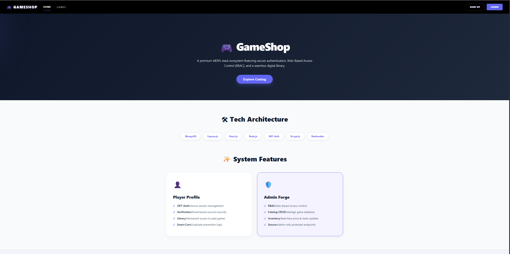

A production-ready full-stack game store platform built using the MERN stack, featuring secure authentication, email verification, smart purchasing logic, and role-based admin controls.

### 🎥 Video Demonstration
Watch the demo here: [[Click to View](https://drive.google.com/drive/folders/1YlwzBJyO-U8C28E3TtsxlKjnicEOvQkM?usp=sharing)]

  

| Layer      | Technology            |
| ---------- | --------------------- |
| Frontend   | React.js , CSS             |
| Backend    | Node.js, Express.js   |
| Database   | MongoDB               |
| Auth       | JWT (JSON Web Tokens) |
| Security   | bcrypt.js             |
| Email      | Nodemailer            |
| State/Auth | Protected Routes      |

✨ System Features

👤 Player Profile

🔐 JWT Authentication — Secure session handling

📧 Email Verification — Account activation via email

🎮 Game Library — Permanent access to purchased games

🛒 Smart Cart Logic — Prevents duplicate purchases

🛠️ Admin Forge

🧩 RBAC (Role-Based Access Control)

📚 Game Catalog CRUD

📊 Inventory Management

🛡️ Admin-only Protected APIs

🔐 Security Practices

Environment variables protected via .env

Passwords hashed using bcrypt

JWT tokens with expiration

Backend-only secrets (never exposed to frontend)
